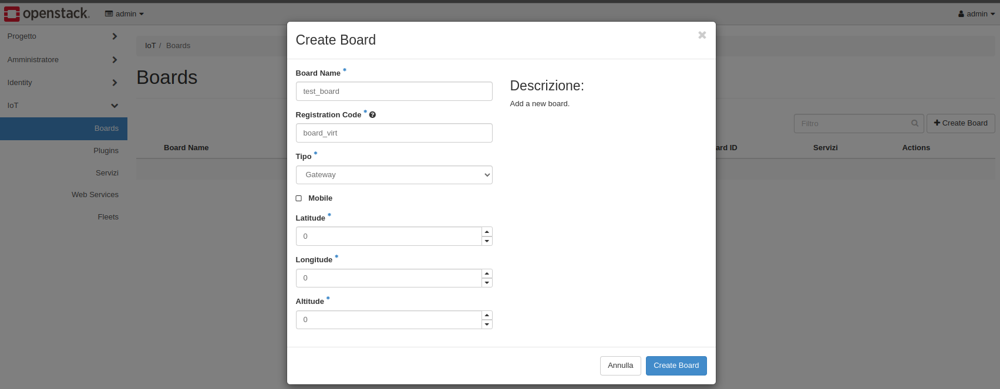
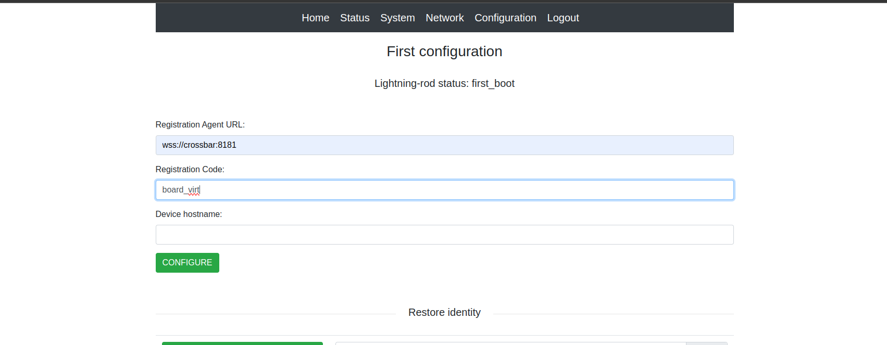
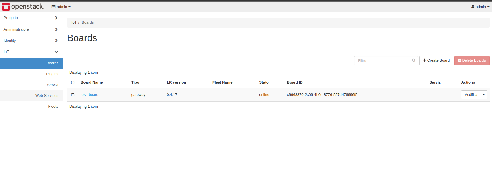
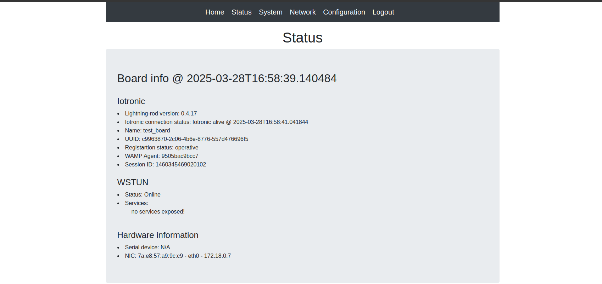

# Stack4Things IoTronic: Docker Compose Deployment Guide

This document describes how to deploy **Stack4Things IoTronic** services using **Docker Compose**. It provides an overview of each container defined in the `docker-compose.yml` file, outlines installation requirements, and offers step-by-step instructions for initializing and running the entire environment.

---

## Table of Contents

1. [Introduction](#introduction)  
2. [Requirements](#requirements)  
3. [Docker Compose Overview](#docker-compose-overview)  
4. [Services Description](#services-description)  
   - [CA Service](#ca-service)  
   - [Crossbar](#crossbar)  
   - [IoT WSTUN](#iot-wstun)  
   - [IoT Database (MariaDB)](#iot-database-mariadb)  
   - [RabbitMQ](#rabbitmq)  
   - [RabbitMQ Setup](#rabbitmq-setup)  
   - [Keystone](#keystone)  
   - [IoTronic Conductor](#iotronic-conductor)  
   - [IoTronic WAgent](#iotronic-wagent)  
   - [IoTronic UI](#iotronic-ui)  
   - [Lightning-Rod](#lightning-rod)  
5. [Configuration and Customization](#configuration-and-customization)  
6. [Deployment Steps](#deployment-steps)  
7. [Verifying the Deployment](#verifying-the-deployment)  
8. [Troubleshooting](#troubleshooting)  
9. [Further Reading](#further-reading)  

---

## Introduction

**Stack4Things** is an IoT framework that integrates with **OpenStack** to provide a robust, cloud-oriented platform for managing IoT devices at scale. The framework uses **IoTronic** as the OpenStack-based service and provides optional components (e.g., database, message queue) that can be either hosted in Docker containers or integrated with existing OpenStack services.

This guide focuses on a **Docker Compose**-based deployment, detailing how each container fits into the larger ecosystem. Once properly configured, this environment enables end-to-end IoTronic functionality—secure communications, device management, logging, and a user interface (UI)—all running within Docker.

---

## Requirements

- **Operating System**: Ubuntu 18.04 (Bionic) or newer, or equivalent Linux distribution.  
- **Docker Engine**: Ensure Docker CE or EE is installed and running.  
- **Docker Compose**: Version 3+ is recommended.  
- **Sufficient Permissions**: The ability to run `docker-compose` and bind to ports (e.g., 80, 3306, etc.).  

If you already have:  
- A separate **MariaDB**, **RabbitMQ**, or **Keystone** from an existing OpenStack setup, you may skip the corresponding container in `docker-compose.yml` or adapt environment variables to point to external services.

---

## Docker Compose Overview

Docker Compose allows defining and running multi-container Docker applications. You specify all your services (containers), networks, and volumes in a single YAML file (`docker-compose.yml`), then run:
```bash
    docker-compose up -d
```
to bring the entire stack up in the background.

---

## Key Benefits

- **Single Configuration File**: Centralizes all container definitions, environment variables, and volumes.  
- **Dependency Management**: Allows specifying `depends_on` to ensure that containers start in a specific order.  
- **Reproducibility**: The same `docker-compose.yml` can be used across environments, ensuring consistent setups.

---

# Connecting a Virtualized IoT Board to Stack4Things

This guide explains how to connect a **virtualized Lightning-Rod board**, running as a Docker container, to the **Stack4Things (S4T)** platform using the provided `docker-compose.yml` environment.

---

##  Overview

- The **Lightning-Rod** container simulates an IoT board.
- The **Crossbar** container acts as the WAMP router.
- The **Stack4Things UI** (`iotronic-ui`) allows registering and managing boards.
- All containers are part of the same Docker network (`s4t`).

---

##  Step-by-Step Setup

### 1. Register the Virtual Board in Stack4Things UI

1. Open the **Stack4Things dashboard** in your browser:

```bash
http://0.0.0.0/horizon
```
(Replace `0.0.0.0` with iotronic-ui Docker host IP if needed)

2. Log in with the default credentials:
- **Username**: `admin`
- **Password**: `s4t`

3. Navigate to the **IoT** section in the Horizon sidebar.

4. Click on **“Create Board”** and provide the required board information.

5. After registration, **copy the board code**. You’ll need it to complete the Lightning-Rod configuration.



---

### 2. Access the Lightning-Rod Web Interface

Open your browser and navigate to:

```bash
http://0.0.0.0:1474
```
(Replace 0.0.0.0 with lightning-rod Docker host IP if needed)

Log in with the default credentials:
- **Username**: `me`
- **Password**: `arancino`

This opens the Lightning-Rod container’s internal configuration interface.

>  Ensure the Lightning-Rod container exposes port `1474` in your `docker-compose.yml`.

---

### 3. Configure the Crossbar Endpoint

In the Lightning-Rod interface:

- Set the **Crossbar URL** to:
 
```bash
wss://crossbar:8181
```
This address works because both containers share the same Docker network (`s4t`), allowing hostname resolution by container name.

---


### 4. Finalize the Lightning-Rod Configuration

Back in the Lightning-Rod browser interface:

- Paste the **board code** from the dashboard registration.
- Submit the form to finalize the connection.

Once submitted, the board will connect to the Crossbar WAMP router and register with the IoTronic Conductor.


---

## ✅ Board Onboarding Complete

The virtualized board is now fully integrated with Stack4Things:

- It is visible in the IoTronic dashboard.
- You can interact with it via the UI.
- Plugins and services can be deployed remotely.



---


## Services Description

### CA Service

- **Role**: Acts as a local Certificate Authority (CA).  
- **Purpose**: Generates SSL/TLS certificates used by other components.  
- **Key Directory**: `/etc/ssl/iotronic/`  
- **Note**: Useful if you do not have a pre-existing CA or certificates.

### Crossbar

- **Role**: WAMP router for real-time event-based communication.  
- **Ports**: Typically runs on port 8181.  
- **Note**: Receives certificates from the CA container.

### IoT WSTUN

- **Role**: Manages WebSocket tunnels allowing IoT devices behind NATs to reach IoTronic.  
- **Ports**: Default is 8080 plus custom tunnels.  
- **Note**: Works together with Crossbar and uses SSL.

### IoT Database (MariaDB)

- **Role**: Stores IoTronic data.  
- **Environment Variables**:  
  - `MYSQL_ROOT_PASSWORD`  
  - `MYSQL_DATABASE`  
  - `MYSQL_USER`  
  - `MYSQL_PASSWORD`  
- **Note**: Creates/migrates schemas on first startup.

### RabbitMQ

- **Role**: Message queue system (optional).  
- **Ports**: 5672 (AMQP), 15672 (web UI).

### RabbitMQ Setup

- **Role**: Initializes users, permissions, tags.  
- **Depends On**: Waits for RabbitMQ to be healthy.

### Keystone

- **Role**: OpenStack identity and authentication service.  
- **Ports**: Usually 5000.  
- **Note**: Optional if already available externally.

### IoTronic Conductor

- **Role**: Core IoTronic component.  
- **Environment Variables**:  
  - `DB_CONNECTION_STRING`  
  - `OS_AUTH_URL`  
  - `OS_USERNAME`  
  - `OS_PASSWORD`

### IoTronic WAgent

- **Role**: Device-side agent that bridges boards to the conductor.  
- **Usage**: For local testing or production devices.

### IoTronic UI

- **Role**: Web-based admin interface.  
- **Port**: 80  
- **Note**: Connects to the conductor API.

### Lightning-Rod

- **Role**: Acts as the runtime agent that runs **on the IoT device itself**.  
- **Function**: Communicates with the IoTronic Conductor and executes plugin logic, controls board status, and manages device-level interactions.  
- **Deployment**: Typically deployed directly on physical devices (e.g., Raspberry Pi, embedded boards).  
- **Note**: In containerized test setups, it can be run inside Docker for simulation, but in production it is usually installed natively on the device OS.

---

## Configuration and Customization

### Environment Variables

Can be set:
- Inline in `docker-compose.yml`  
- In an external `.env` file  
- As Docker secrets

### Volumes

Used for:
- Database data (`unime_iotronic_db_data`)  
- SSL certs (`iotronic_ssl`)  
- Logs (`iotronic_logs`, `iotronic-ui_logs`)

### Networking

Services are placed on a user-defined Docker network (e.g., `s4t`) and can reach each other by hostname.

### Ports

Check `ports:` entries and adapt to your host as needed (e.g., `8080:8080`, `5000:5000`).

---

## Deployment Steps

### 1. Review the `docker-compose.yml` File

- Adjust environment variables and services.  
- Remove/comment containers you don't need.

### 2. (Optional) Build or Pull the Images
```bash
    docker-compose build
```
### 3. Launch the Deployment
```bash
    docker-compose up -d
```
- Creates network  
- Starts containers in correct order  
- Logs handled via Docker engine

### 4. Check Logs
```bash
    docker-compose logs -f
```
Press `Ctrl+C` to stop watching logs (containers stay running).

### 5. Validate Service Health
```bash
    docker ps
```
---

## Verifying the Deployment

- **CA Service**: Check if certificates are in `/etc/ssl/iotronic/`.  
- **Crossbar**: Should listen on port 8181. Check logs with:
```bash
      docker-compose logs crossbar
```
- **MariaDB**: Test access with:
```bash
      docker exec -it iotronic-db mysql -uroot -punime
```
- **Conductor**: Should respond on port 8812.  
- **UI**: Open your browser to:  
  `http://<your_docker_host_or_ip>/`

## Stopping and Removing the Deployment

Upon completion of testing, or if it becomes necessary to dismantle the environment, all containers, networks, and associated resources can be stopped and removed as follows:

### Stop and Remove Containers
```bash
      docker-compose down
```
This command halts and removes all containers defined in the `docker-compose.yml` configuration file.

### (Optional) Remove Persistent Volumes
```bash
      docker-compose down -v
```
Appending the `-v` flag will also delete any named volumes (e.g., for the database, logs, or certificates), resulting in the loss of all persisted data.

⚠️ **Warning**: This operation is irreversible. Ensure that all critical data has been properly backed up before proceeding with the `-v` option.
---

## Troubleshooting

### Containers Restarting

- Verify environment variables  
- Check for port conflicts  
- Ensure dependencies are available

### Database Connectivity Issues

- Confirm that `iotronic-db` is healthy  
- Check `DB_CONNECTION_STRING`  
- Ensure external DB (if any) is reachable

### SSL Certificate Problems

- Confirm CA container generated certificates  
- Check volume sharing and file permissions

### Keystone Authentication Fails

- Check `OS_AUTH_URL`, `OS_USERNAME`, `OS_PASSWORD`, etc.  
- Make sure port 5000 is reachable inside the Docker network

### Logs
```bash
    docker-compose logs -f <service_name>
```
### Cleanup (use with caution)
```bash
    docker system prune -f
```
> ⚠️ This will remove unused containers, images, networks, and volumes.

---

## Further Reading

- [Iotronic (S4T Cloud-Side) Official Repo](https://opendev.org/x/iotronic)
- [Lightning-Rod (S4T Device-Side) Official Repo](https://opendev.org/x/iotronic-lightning-rod)
- [Iotronic-UI (S4T Dashboard) Official Repo](https://opendev.org/x/iotronic-ui)
- [Iotronic-Client (S4T CLI) Official Repo](https://opendev.org/x/python-iotronicclient)
- [Docker Documentation](https://docs.docker.com)
- [Docker Compose Docs](https://docs.docker.com/compose)
- [OpenStack Documentation](https://docs.openstack.org)

---

## Disclaimer

This guide assumes standard Docker and Compose usage.  
Always secure your `.env` files and manage certificates properly.  
For production, consider:

- Volume and data backups  
- TLS everywhere  
- Service monitoring  
- Least-privilege credentials

---

© 2025 MDSLab, University of Messina  
*Feel free to modify or extend this guide for your organization’s needs.*
